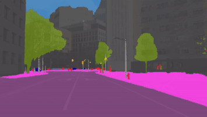
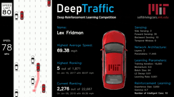

# MIT Deep Learning

This repository is a collection of tutorials for [MIT Deep Learning](https://deeplearning.mit.edu/) courses. More added as courses progress.

## Tutorial: Deep Learning Basics

This tutorial accompanies the [lecture on Deep Learning Basics](https://www.youtube.com/watch?list=PLrAXtmErZgOeiKm4sgNOknGvNjby9efdf&v=O5xeyoRL95U). It presents several concepts in deep learning, demonstrating the first two (feed forward and convolutional neural networks) and providing pointers to tutorials on the others. This is a good place to start.

Links: \[ [Jupyter Notebook](https://github.com/lexfridman/mit-deep-learning/blob/master/tutorial_deep_learning_basics/deep_learning_basics.ipynb) \]
\[ [Google Colab](https://colab.research.google.com/github/lexfridman/mit-deep-learning/blob/master/tutorial_deep_learning_basics/deep_learning_basics.ipynb) \]

## Tutorial: Driving Scene Segmentation

This tutorial demostrates semantic segmentation with a state-of-the-art model (DeepLab) on a sample video from the MIT Driving Scene Segmentation Dataset.

Links: \[ [Jupyter Notebook](https://github.com/lexfridman/mit-deep-learning/blob/master/tutorial_driving_scene_segmentation/tutorial_driving_scene_segmentation.ipynb) \]
\[ [Google Colab](https://colab.research.google.com/github/lexfridman/mit-deep-learning/blob/master/tutorial_driving_scene_segmentation/tutorial_driving_scene_segmentation.ipynb) \]

## DeepTraffic Deep Reinforcement Learning Competition

DeepTraffic is a deep reinforcement learning competition. The goal is to create a neural network that drives a vehicle (or multiple vehicles) as fast as possible through dense highway traffic.

Links: \[ [GitHub](https://github.com/lexfridman/deeptraffic) \] \[ [Website](https://selfdrivingcars.mit.edu/deeptraffic) \] \[ [Paper](https://arxiv.org/abs/1801.02805) \]

## Team

- [Lex Fridman](https://lexfridman.com)
- [Li Ding](https://www.mit.edu/~liding/)
- [Jack Terwilliger](https://www.mit.edu/~jterwill/)
- [Michael Glazer](https://www.mit.edu/~glazermi/)
- [Aleksandr Patsekin](https://www.mit.edu/~patsekin/)
- [Aishni Parab](https://www.mit.edu/~aishni/)
- [Dina AlAdawy](https://www.mit.edu/~aladawy/)
- [Henri Schmidt](https://www.mit.edu/~henris/)
